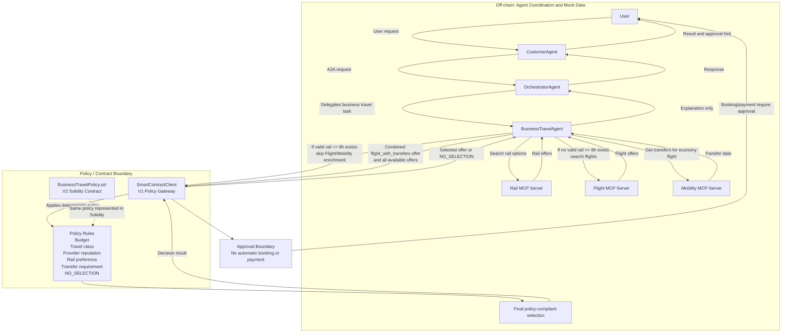

# Business Travel Architecture Diagram

Der Prototyp trennt Informationsbeschaffung, Koordination und finale Entscheidung. Die Agenten sammeln Reiseoptionen, strukturieren sie und fuehren den Nutzer durch den Prozess, ohne die rechtlich oder organisatorisch relevante Auswahl selbst zu treffen.

Ein LLM kann in diesem System beim Verstehen einer Anfrage, bei der Delegation und bei der sprachlichen Erklaerung helfen. Es ist jedoch nicht die Instanz, die entscheidet, welche Reiseoption policy-konform gewinnt.

Der `BusinessTravelAgent` koordiniert die MCP-Server. Zuerst werden Bahnoptionen abgefragt. Wenn eine gueltige Bahnoption unter oder gleich acht Stunden existiert, wird Flight/Mobility-Enrichment uebersprungen, weil die Policy Bahn in diesem Fall bevorzugt.

Wenn keine gueltige Bahnoption unter oder gleich acht Stunden existiert, ruft der `BusinessTravelAgent` zusaetzlich den Flight MCP Server und den Mobility MCP Server auf. Daraus wird ein kombiniertes Angebot mit `mode == "flight_with_transfers"` gebaut und zusammen mit den verfuegbaren Angeboten an die Policy-Schicht uebergeben.

Der `SmartContractClient` simuliert in V1 die Smart-Contract-Policy. Er prueft Budget, Reiseklasse, Provider-Reputation, Bahnprioritaet, Transferpflicht und den Fall `NO_SELECTION`. Die finale Auswahl erfolgt deterministisch in dieser Komponente.

Der Solidity Contract `contracts/BusinessTravelPolicy.sol` zeigt in V2, dass dieselbe Policy auch als Smart-Contract-Logik abbildbar ist. Der laufende Python-Prototyp nutzt weiterhin den `SmartContractClient`-Mock; eine Python-Web3-Integration ist nicht Teil dieser Version.

A2A Multi-Turn dient nur dazu, fehlende Angaben wie den Startpunkt nachzufragen und im bestehenden Kontext zu ergaenzen. Diese Rueckfragen veraendern nicht die Policy-Entscheidung und geben dem Agenten keine finale Entscheidungsmacht.

Buchung und Zahlung werden nicht automatisch ausgefuehrt. Das Ergebnis enthaelt nur den Hinweis, dass eine Genehmigung erforderlich ist; die eigentliche Freigabe liegt ausserhalb dieses Prototyps.
