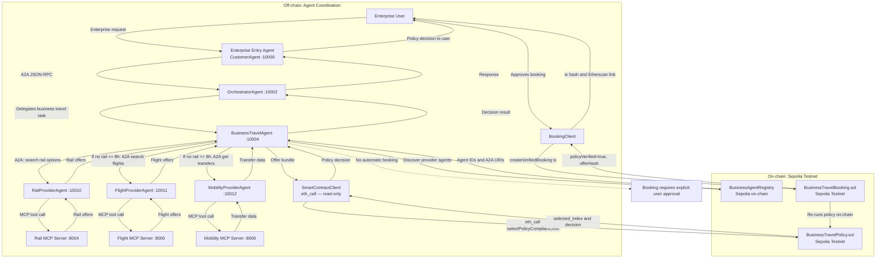

# Enterprise Policy Platform — Architecture Diagram

Der Prototyp trennt Informationsbeschaffung, Koordination und finale Entscheidung in drei Schichten.

**Koordinationsschicht (Off-chain):** Der `BusinessTravelAgent` entdeckt Provider-Agenten zur Laufzeit aus dem `BusinessAgentRegistry` auf Sepolia. Er ruft `RailProviderAgent`, `FlightProviderAgent` und `MobilityProviderAgent` via A2A auf, die wiederum ihre jeweiligen MCP-Server nutzen. Das kombinierte Angebot (`flight_with_transfers`) entsteht durch Zusammenfuehren eines Flugangebots mit Transferdaten — der Agent entscheidet nur, ob Flight/Mobility-Anreicherung noetig ist, nicht welches Angebot gewinnt.

**Policy-Schicht (On-chain, read-only):** Der `SmartContractClient` ruft `BusinessTravelPolicy.selectPolicyCompliantOffer` via `eth_call` auf — keine Transaktion, keine Gaskosten. Der Solidity-Contract prueft Bahnpraeferenz, Budget, Reiseklasse, Provider-Reputation, Transferpflicht und gibt `NO_SELECTION` (`type(uint256).max`) zurueck, wenn kein Angebot policy-konform ist. LLM und Agent koennen das Ergebnis erklaeren, aber nicht veraendern.

**Buchungsschicht (On-chain, Transaktion):** Erst nach expliziter Nutzerfreigabe ruft der `BookingClient` `BusinessTravelBooking.createVerifiedBooking` auf. Der Booking-Contract fuehrt `selectPolicyCompliantOffer` erneut on-chain aus und vergleicht das Ergebnis mit dem uebergebenen `selected_index` — eine Manipulation zwischen Policy-Aufruf und Buchung wuerde zur Reversion fuehren. Gespeichert werden `policyVerified=true` und ein `offerHash` als kryptografischer Fingerabdruck des verifizierten Angebots. Es handelt sich um eine Sepolia-Simulation — keine echte Reisebuchung, keine echte Zahlung.

**A2A Multi-Turn:** Fehlende Angaben (z.B. Startpunkt) werden kontrolliert nachgefragt. Der A2A-Kontext bleibt erhalten; Folgeantworten werden als fehlende Slots interpretiert. Die Policy-Entscheidung wird dadurch nicht veraendert.
